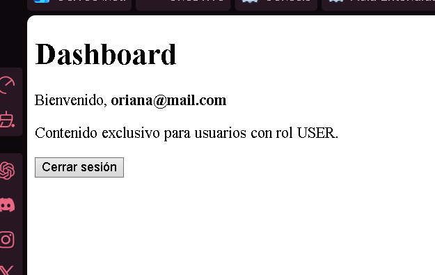

# Taller Post-Contenido 1 – Unidad 9: Seguridad en Aplicaciones Web

**Autor:** Oriana Jaimes  
**Curso:** Programación Web  
**Programa:** Ingeniería de Sistemas  
**Universidad de Santander – UDES**  
**Año:** 2026

---

## Descripción del proyecto

Este proyecto implementa un sistema de autenticación y autorización completo utilizando **Spring Boot 4** y **Spring Security 6**. El sistema permite el registro de usuarios con contraseñas cifradas mediante BCrypt, inicio de sesión basado en formulario que consulta una base de datos MySQL, y control de acceso diferenciado por roles (`ROLE_ADMIN` y `ROLE_USER`) con rutas protegidas.

---

## Tecnologías utilizadas

El proyecto fue construido con Spring Boot 4.0.6, Spring Security 6, Spring Data JPA con Hibernate 7, Thymeleaf como motor de plantillas con el módulo `thymeleaf-extras-springsecurity6`, MySQL 5.5 mediante XAMPP, y Java 22. La gestión de dependencias se realiza con Maven.

---

## Requisitos previos

Para ejecutar este proyecto en un entorno local se necesita tener instalado Java 17 o superior, Maven, XAMPP con MySQL corriendo en el puerto 3306, y un IDE como Visual Studio Code con las extensiones de Java.

---

## Configuración de la base de datos

Antes de ejecutar el proyecto es necesario tener MySQL activo desde el panel de control de XAMPP. Una vez activo, se debe crear la base de datos ejecutando la siguiente sentencia en phpMyAdmin (`http://localhost/phpmyadmin`) desde la pestaña SQL:

```sql
CREATE DATABASE IF NOT EXISTS estudiantes_db;
```

Hibernate se encarga automáticamente de crear la tabla `usuarios` al arrancar la aplicación por primera vez gracias a la configuración `spring.jpa.hibernate.ddl-auto=update`.

---

## Configuración de `application.properties`

El archivo de configuración se encuentra en `src/main/resources/application.properties` y debe contener los siguientes valores para conectarse a MySQL con XAMPP:

```properties
spring.datasource.url=jdbc:mysql://localhost:3306/estudiantes_db?useSSL=false&serverTimezone=UTC
spring.datasource.username=root
spring.datasource.password=

spring.datasource.driver-class-name=com.mysql.cj.jdbc.Driver
spring.jpa.hibernate.ddl-auto=update
spring.jpa.show-sql=true
spring.thymeleaf.cache=false

spring.datasource.hikari.max-lifetime=600000
spring.datasource.hikari.connection-test-query=SELECT 1
spring.datasource.hikari.connection-timeout=30000
```

> **Nota:** Con XAMPP el usuario por defecto es `root` y la contraseña está vacía.

---

## Cómo ejecutar el proyecto

Con MySQL corriendo en XAMPP, abrir una terminal en la **carpeta raíz del proyecto** (donde se encuentra el archivo `pom.xml`) y ejecutar el siguiente comando:

```bash
mvn spring-boot:run
```

Cuando la consola muestre el mensaje `Started SeguridadApplication in X seconds`, el proyecto está listo. Abrir el navegador y acceder a `http://localhost:8080`.

> **Importante:** Si el puerto 8080 ya está en uso, ejecutar `netstat -ano | findstr :8080` para encontrar el proceso y cerrarlo con `taskkill /PID [número] /F`.

---

## Usuarios de prueba

Los siguientes usuarios pueden utilizarse para probar el sistema. Las contraseñas se muestran en texto claro para facilidad de pruebas; en la base de datos se almacenan como hashes BCrypt.

**Usuario con rol ADMIN:**
- Email: `admin@universidad.edu`
- Contraseña: `admin123`
- Acceso: todas las rutas, incluyendo `/admin`

**Usuario con rol USER:**
- Email: `oriana@mail.com` (o el correo que se registró durante las pruebas)
- Contraseña: la contraseña usada al registrarse
- Acceso: dashboard únicamente, sin acceso a `/admin`

---

## Estructura del proyecto

```
seguridad/
├── src/main/java/com/universidad/seguridad/
│   ├── config/
│   │   └── SecurityConfig.java         ← Configuración de Spring Security
│   ├── controller/
│   │   └── AuthController.java         ← Controlador de rutas
│   ├── model/
│   │   └── Usuario.java                ← Entidad JPA
│   ├── repository/
│   │   └── UsuarioRepository.java      ← Acceso a base de datos
│   ├── service/
│   │   ├── UsuarioService.java         ← Lógica de registro y BCrypt
│   │   └── UsuarioDetailsService.java  ← Puente con Spring Security
│   └── SeguridadApplication.java
├── src/main/resources/
│   ├── templates/
│   │   ├── auth/
│   │   │   ├── login.html              ← Formulario de inicio de sesión
│   │   │   └── registro.html           ← Formulario de registro
│   │   ├── admin/
│   │   │   └── panel.html              ← Panel exclusivo para ADMIN
│   │   └── dashboard.html              ← Página principal tras login
│   └── application.properties
└── pom.xml
```

---

## Rutas de la aplicación

La ruta `/` es pública y accesible sin autenticación. La ruta `/login` muestra el formulario de inicio de sesión y también es pública. La ruta `/registro` permite crear una nueva cuenta y es pública. La ruta `/dashboard` requiere estar autenticado y es accesible para cualquier rol. La ruta `/admin` está protegida y solo es accesible para usuarios con `ROLE_ADMIN`; cualquier intento de acceso por parte de un `ROLE_USER` resulta en un error 403 Forbidden.

---

## Evidencia de funcionamiento

### Formulario de inicio de sesión


### Formulario de registro de usuario


### Dashboard con rol USER


### Panel de administración (solo ADMIN)


### Contraseña hasheada con BCrypt en MySQL


