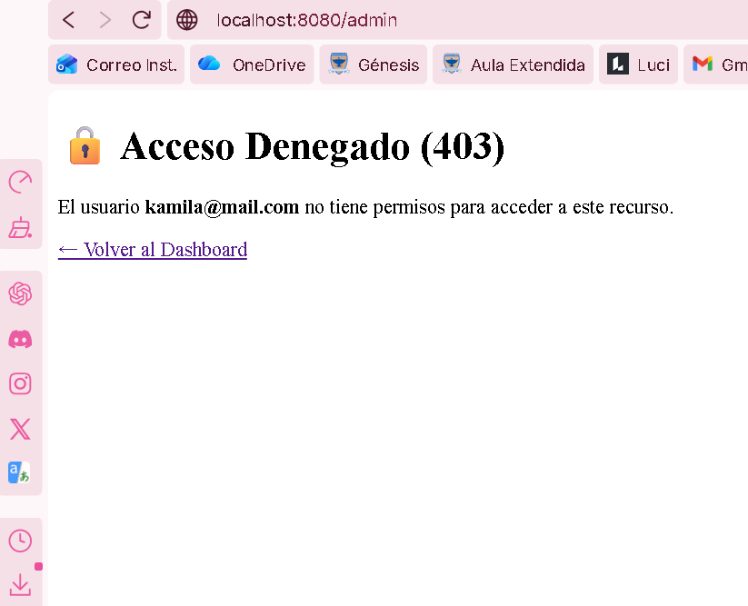
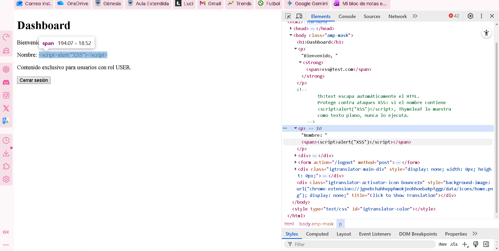
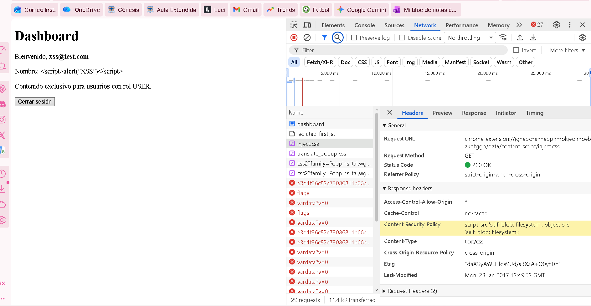
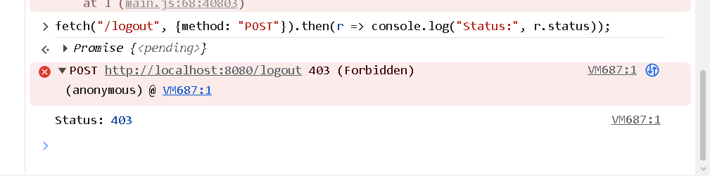
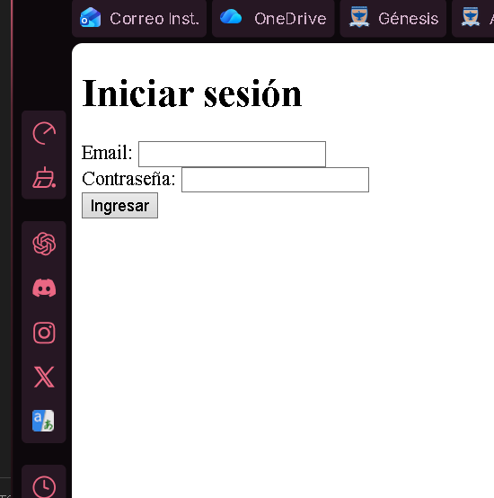
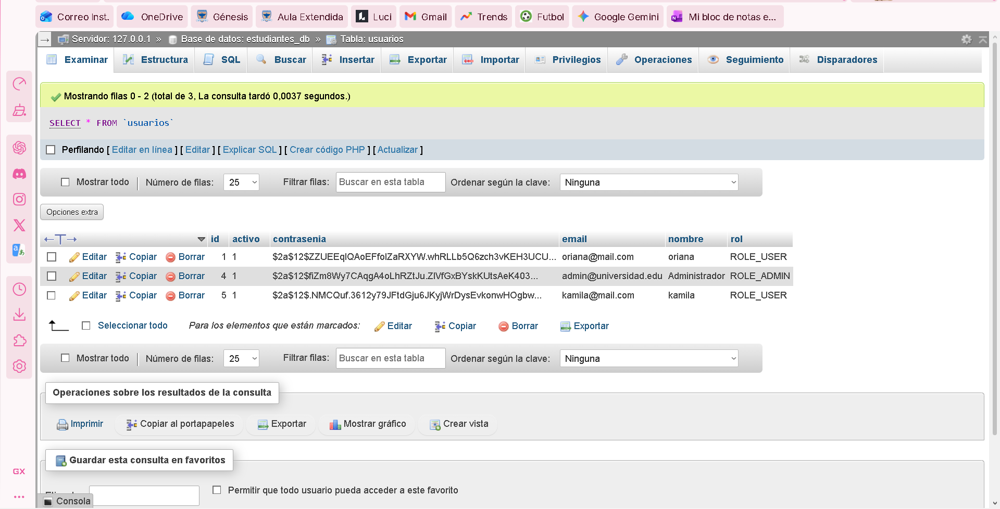
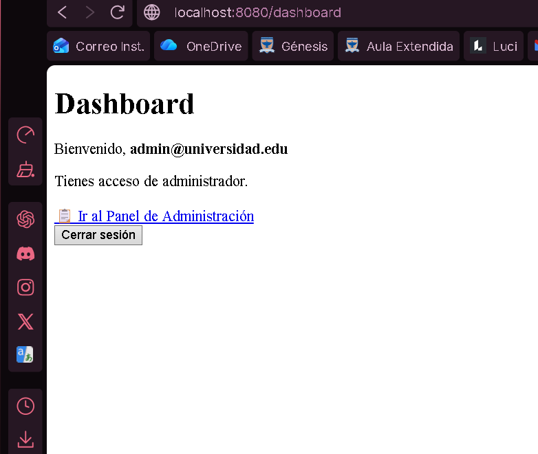
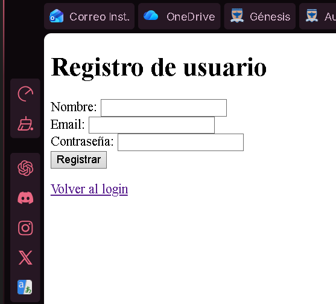

# Taller Post-Contenido 2 – Unidad 9: Seguridad en Aplicaciones Web

**Curso:** Programación Web  
**Programa:** Ingeniería de Sistemas  
**Universidad de Santander – UDES**  
**Año:** 2026

---

## Descripción del proyecto

Este proyecto es la extensión del Post-Contenido 1. Sobre el sistema de autenticación ya construido con Spring Security 6, se implementaron y verificaron activamente tres capas adicionales de seguridad: autorización a nivel de método con `@PreAuthorize`, mitigación de ataques XSS mediante Thymeleaf y una política Content-Security-Policy (CSP), y verificación de la protección CSRF comprobando que formularios sin token son rechazados con error 403.

---

## Tecnologías utilizadas

Spring Boot 4.0.6, Spring Security 6, Spring Data JPA con Hibernate 7, Thymeleaf con `thymeleaf-extras-springsecurity6`, MySQL 5.5 mediante XAMPP, y Java 22. La gestión de dependencias se realiza con Maven.

---

## Requisitos previos

Para ejecutar este proyecto se necesita tener instalado Java 17 o superior, Maven, XAMPP con MySQL corriendo en el puerto 3306, y Visual Studio Code con las extensiones de Java.

---

## Configuración de la base de datos

Con MySQL activo desde el panel de XAMPP, la base de datos `estudiantes_db` debe existir. Si no existe, ejecutar en phpMyAdmin:

```sql
CREATE DATABASE IF NOT EXISTS estudiantes_db;
```

Hibernate crea la tabla `usuarios` automáticamente al arrancar la aplicación.

---

## Cómo ejecutar el proyecto

Abrir una terminal en la carpeta raíz del proyecto (donde está el `pom.xml`) y ejecutar:

```bash
mvn spring-boot:run
```

Cuando la consola muestre `Started SeguridadApplication in X seconds`, abrir el navegador en `http://localhost:8080`.

---

## Usuarios de prueba

**Usuario ADMIN:**
- Email: `admin@universidad.edu`
- Contraseña: `admin123`
- Acceso: todas las rutas incluyendo `/admin`

**Usuario USER:**
- Email: `kamila@mail.com`
- Contraseña: kami123
- Acceso: solo dashboard, sin acceso a `/admin`

**Usuario de prueba XSS:**
- Email: `xss@test.com`
- Contraseña: `test123`
- Nombre registrado: `<script>alert("XSS")</script>`

---

## Estructura del proyecto

```
seguridad/
├── src/main/java/com/universidad/seguridad/
│   ├── config/
│   │   └── SecurityConfig.java         ← Configuración de Spring Security, CSP y manejo de 403
│   ├── controller/
│   │   ├── AuthController.java         ← Controlador de rutas principales
│   │   └── ErrorController.java        ← Controlador para página de error 403
│   ├── model/
│   │   └── Usuario.java                ← Entidad JPA
│   ├── repository/
│   │   └── UsuarioRepository.java      ← Acceso a base de datos
│   ├── service/
│   │   ├── UsuarioService.java         ← Lógica de negocio con @PreAuthorize
│   │   └── UsuarioDetailsService.java  ← Puente con Spring Security
│   └── SeguridadApplication.java
├── src/main/resources/
│   ├── templates/
│   │   ├── auth/
│   │   │   ├── login.html
│   │   │   └── registro.html
│   │   ├── admin/
│   │   │   └── panel.html
│   │   ├── error/
│   │   │   └── 403.html                ← Página personalizada de acceso denegado
│   │   └── dashboard.html
│   └── application.properties
└── pom.xml
```

---

## Implementación de @PreAuthorize

Se agregaron cuatro métodos con distintas expresiones SpEL en `UsuarioService`, llevando la seguridad a la capa de servicio como segunda línea de defensa independiente de las URLs.

```java
// Solo ADMIN puede listar todos los usuarios
@PreAuthorize("hasRole('ADMIN')")
public List<Usuario> listarTodos() { ... }

// ADMIN puede ver cualquier perfil, USER solo el suyo propio
@PreAuthorize("hasRole('ADMIN') or #email == authentication.name")
public Optional<Usuario> buscarPorEmail(String email) { ... }

// Solo ADMIN puede cambiar roles
@PreAuthorize("hasRole('ADMIN')")
public void cambiarRol(Long id, String nuevoRol) { ... }

// Un usuario solo puede actualizar sus propios datos
@PreAuthorize("#usuario.email == authentication.name or hasRole('ADMIN')")
public void actualizarNombre(Usuario usuario) { ... }
```

---

## Prueba 1: @PreAuthorize — Error 403 personalizado

**¿Qué se probó?** Se inició sesión con un usuario `ROLE_USER` e intentó acceder a `http://localhost:8080/admin`, ruta protegida exclusivamente para `ROLE_ADMIN`.

**Resultado esperado:** Spring Security intercepta la petición, detecta que el usuario no tiene el rol requerido, y redirige a la página de error 403 personalizada que muestra el email del usuario autenticado.

**Resultado obtenido:** La página `error/403.html` se mostró correctamente con el email del usuario visible, confirmando que `@PreAuthorize` y `accessDeniedPage` funcionan correctamente.

### Captura: Página de error 403 personalizada


---

## Prueba 2: Mitigación de XSS con Thymeleaf

**¿Qué se probó?** Se registró un usuario cuyo campo nombre contenía el payload XSS: `<script>alert("XSS")</script>`. Luego se inició sesión con ese usuario para verificar que el dashboard no ejecutara el script.

**¿Por qué th:text protege contra XSS?** Cuando Thymeleaf renderiza contenido con `th:text`, convierte automáticamente los caracteres especiales HTML en entidades escapadas. El símbolo `<` se convierte en `&lt;` y `>` en `&gt;`, de modo que el navegador interpreta el contenido como texto plano y nunca como código ejecutable.

**Resultado esperado:** El dashboard muestra el texto `<script>alert("XSS")</script>` de forma literal sin ejecutar ninguna alerta emergente. En el inspector HTML aparece `&lt;script&gt;` en lugar de `<script>`.

**Resultado obtenido:** El script se mostró como texto plano en la pantalla sin ejecutarse. Al inspeccionar el elemento en DevTools se confirmó el escape correcto del HTML.

**Nota:** Nunca usar `th:utext` con datos de usuarios ya que inserta HTML sin escapar y representa un riesgo directo de XSS almacenado.

### Captura: Inspector HTML mostrando el script escapado


---

## Prueba 3: Content-Security-Policy (CSP)

**¿Qué se configuró?** Se agregó una cabecera CSP en `SecurityConfig` que le indica al navegador qué fuentes de contenido son legítimas, bloqueando la carga de scripts externos maliciosos incluso si lograran inyectarse en la página.

```java
.headers(headers -> headers
    .contentSecurityPolicy(csp -> csp
        .policyDirectives(
            "default-src 'self'; " +
            "script-src 'self'; " +
            "style-src 'self' 'unsafe-inline'; " +
            "img-src 'self' data:; " +
            "frame-ancestors 'none'"
        )
    )
)
```

**Verificación:** Se abrió DevTools con F12, pestaña Network, y se inspeccionaron los Response Headers de la petición al dashboard. La cabecera `Content-Security-Policy` apareció correctamente con los valores configurados.

### Captura: CSP header en DevTools


---

## Prueba 4: Protección CSRF

**¿Qué se probó?** Se intentó enviar una petición POST a `/logout` sin incluir el token CSRF, usando `fetch` desde la consola del navegador.

**¿Por qué CSRF es importante?** Sin esta protección, un atacante podría crear una página maliciosa que al ser visitada envíe peticiones en nombre del usuario autenticado sin su conocimiento. Spring Security genera un token único por sesión que debe incluirse en todo POST.

**Comando ejecutado en la consola del navegador:**
```javascript
fetch("/logout", { method: "POST" }).then(r => console.log("Status:", r.status));
```

**Resultado esperado:** El servidor responde `403 Forbidden` porque la petición no incluye el token `_csrf` válido.

**Resultado obtenido:** La consola mostró `Status: 403`, confirmando que Spring Security rechazó correctamente la petición sin token CSRF.

### Captura: CSRF 403 en consola del navegador


---

## Evidencia adicional

### Formulario de inicio de sesión


### Contraseña hasheada con BCrypt en MySQL


### Panel de administración exclusivo para ADMIN


### Formulario de registro

